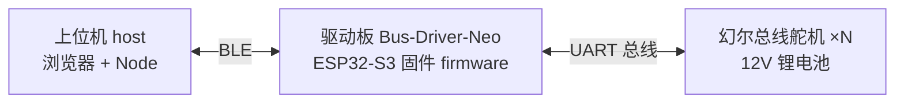

# 基于幻尔舵机的仿生蛇 / Bionic Snake Robot

基于 **ESP32-S3 + 幻尔（Hiwonder）总线舵机** 的八节仿生蛇形机器人，完整开源下位机固件、调试上位机与硬件设计。

**核心卖点：不用写一行代码进行调蛇** —— 可自定义步态，自由设置正弦运动的摆幅、波速等参数；配合 0 代码"编舞"功能，调试蛇步态无需再区分"电控组"与"结构组"。

## 演示视频（Bilibili）

全部演示与讲解视频已整理为 B 站合集：**[基于幻尔舵机的仿生蛇 · 演示合集](https://www.bilibili.com/video/BV1wiaU6REHN)**

内容包括：蛇的手动校准与自定义步态、自动校准算法、运动算法推导讲解。

## 系统组成

| 目录 | 内容 |
| --- | --- |
| [firmware/](firmware/README.md) | ESP32-S3 下位机固件（正弦运动算法、自校准、动作组、BLE 双协议） |
| [host/](host/README.md) | 跨平台调试上位机（Web 前端 + Node 后端，BLE 连接） |
| [hardware/](hardware/README.md) | 自研驱动板 Bus-Driver-Neo（嘉立创工程 / Gerber / BOM / 3D / 测试代码） |
| [docs/](docs/README.md) | 运动算法推导、两套通信协议、0 代码编舞、代码框架说明 |

## 适配硬件

- 自研舵机驱动板 **Bus-Driver-Neo**（本仓库提供全套硬件文件，建议直接 SMT）
- 幻尔（Hiwonder）**总线舵机**（LX-224 等）
- **12V 锂电池**（电流容量 ≥ 2800mA）

幻尔舵机的官方资料（舵机规格书、总线舵机通信协议、Bus Servo Terminal 调试软件等）请从[幻尔官网](https://www.hiwonder.com/)获取，本仓库不随附分发。

## 快速开始

### A. 完整复刻（推荐）

1. 用 [hardware/](hardware/README.md) 中的 Gerber + BOM 下单 PCB（或直接 SMT）
2. 焊接验证：烧录 `hardware/test_code/` 测试舵机接口
3. 烧录 [firmware/](firmware/README.md) 正式固件
4. 运行 [host/](host/README.md) 上位机，BLE 连接后自动/手动校准，开始调步态

### B. 只想看算法与文档

直接阅读 [docs/](docs/README.md)，从[运动算法](docs/运动算法/算法提炼.md)开始。

### C. 用自己的主控/舵机

参考 [docs/二进制通信协议](docs/二进制通信协议/通信协议.md) 与 [字符串通信协议](docs/字符串通信协议/字符串通信协议文档.md) 移植协议层即可。

## 开源说明

- 本项目完全开源，欢迎各位接手开发，Issue / PR 均欢迎
- 硬件部分基于嘉立创 EDA 设计
- 许可证：[MIT](LICENSE)
