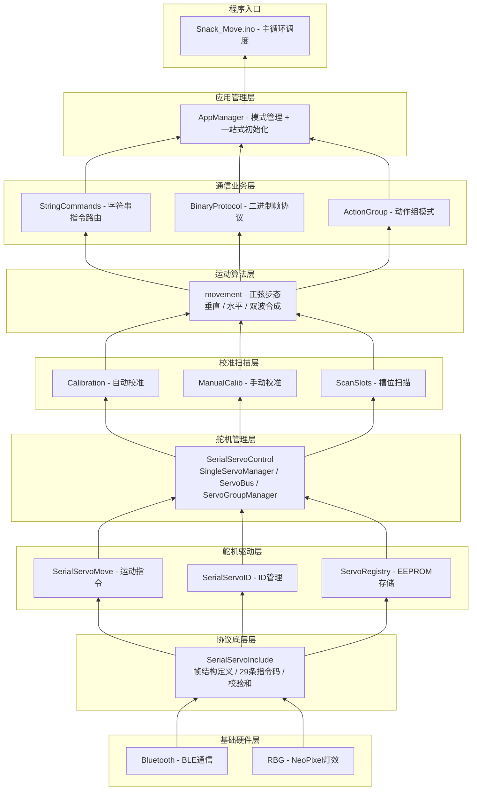
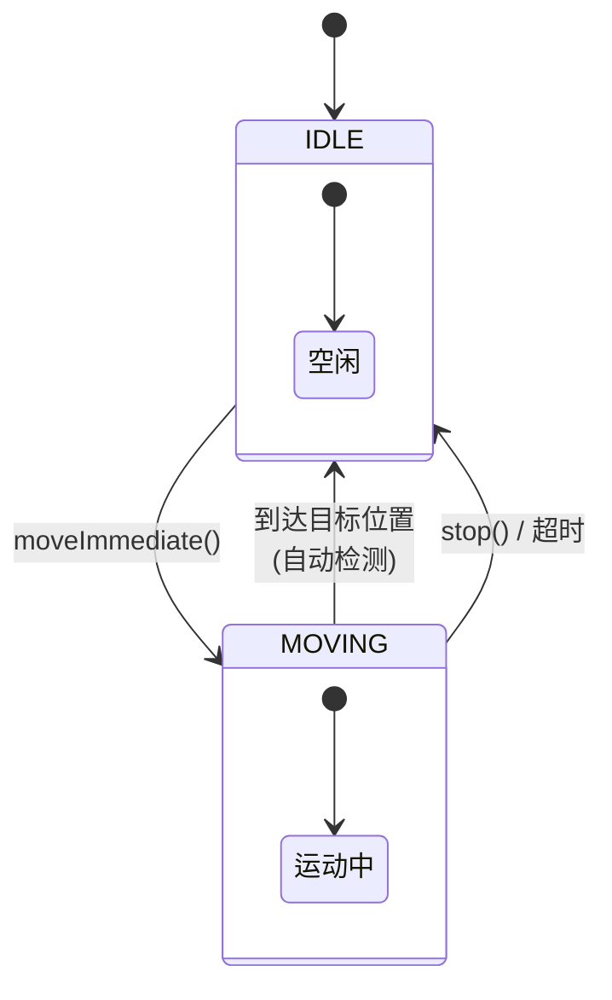
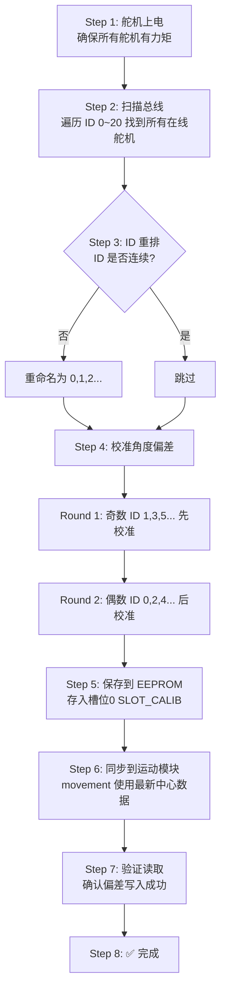
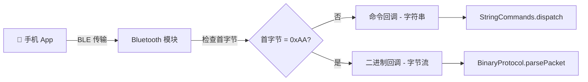
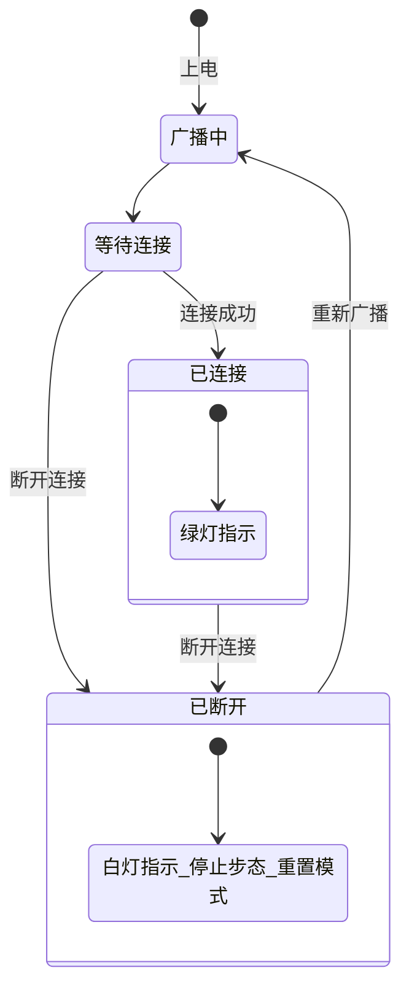
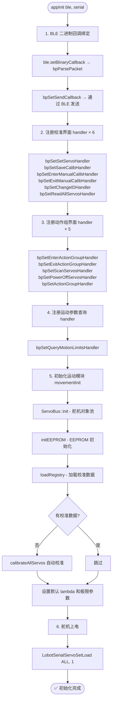
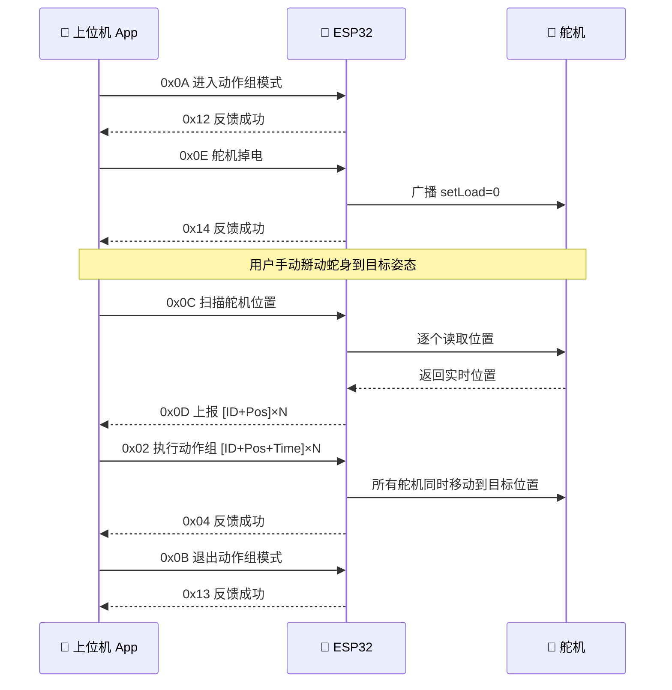
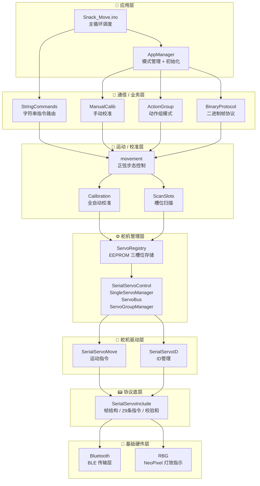

# 🐍 仿生机器蛇控制代码 — 系统说明文档

> **适用对象：** 刚接手此项目的同学  
> **硬件平台：** ESP32 + 总线舵机 (Lobot/LSC系列) + NeoPixel LED  
> **开发环境：** Arduino Framework  
> **最后更新：** 2026年6月

---

## 📖 目录

1. [项目概览](#-项目概览)
2. [代码架构总览](#-代码架构总览)
3. [快速上手：我应该先看哪些文件？](#-快速上手我应该先看哪些文件)
4. [第一层：舵机总线协议层 — SerialServoInclude](#-第一层舵机总线协议层--serialservoinclude)
5. [第二层：舵机驱动层 — 功能模块](#-第二层舵机驱动层--功能模块)
   - [SerialServoMove — 运动控制](#serialservomove--运动控制)
   - [SerialServoID — ID管理](#serialservoid--id管理)
   - [ServoRegistry — EEPROM存储](#servoregistry--eeprom存储)
6. [第三层：面向对象的舵机管理层 — SerialServoControl](#-第三层面向对象的舵机管理层--serialservocontrol)
   - [SingleServoManager — 单舵机管理器](#singleservomanager--单舵机管理器)
   - [ServoBus — 全局舵机对象池](#servobus--全局舵机对象池)
   - [ServoGroupManager — 舵机组管理器](#servogroupmanager--舵机组管理器)
7. [第四层：运动算法模块 — movement](#-第四层运动算法模块--movement)
   - [工作原理：正弦步态](#工作原理正弦步态)
   - [三种步态模式](#三种步态模式)
   - [关键参数说明](#关键参数说明)
8. [第五层：校准系统 — Calibration & ManualCalib](#-第五层校准系统--calibration--manualcalib)
   - [全自动校准流程](#全自动校准流程)
   - [手动校准模式](#手动校准模式)
9. [第六层：通信协议层](#-第六层通信协议层)
   - [字符串协议 — StringCommands](#字符串协议--stringcommands)
   - [二进制协议 — BinaryProtocol](#二进制协议--binaryprotocol)
   - [BLE蓝牙传输 — Bluetooth](#ble蓝牙传输--bluetooth)
10. [第七层：应用管理层 — AppManager](#-第七层应用管理层--appmanager)
11. [第八层：入口与辅助模块](#-第八层入口与辅助模块)
    - [主程序入口 — Snack_Move.ino](#主程序入口--snack_moveino)
    - [动作组模式 — ActionGroup](#动作组模式--actiongroup)
    - [扫描槽位 — ScanSlots](#扫描槽位--scanslots)
    - [状态指示灯 — RBG](#状态指示灯--rbg)
12. [附录：模块依赖关系图](#-附录模块依赖关系图)

---

## 🎯 项目概览

这是一套运行在 **ESP32** 上的仿生机器蛇完整控制固件。简单来说，这套代码让你能够：

- 通过手机 **蓝牙** 连接机器蛇，发送指令控制它运动
- 支持 **两种通信方式**：方便人类调试的字符串命令，以及给上位机 App 用的二进制协议
- 实现了蛇类特有的 **正弦波步态**（蜿蜒前进/后退），还能水平和垂直合成运动
- 具备 **全自动舵机校准** 功能，无需手动调参就能让所有关节对准中心
- 支持 **动作组** 功能——记录、保存、回放预设姿态

> 💡 **一句话理解代码分工：** 协议层负责"怎么传数据"，驱动层负责"怎么转舵机"，运动层负责"怎么扭成蛇形"，校准层负责"怎么让舵机听话"。

---

## 🏗 代码架构总览

代码采用**分层架构**设计，从底向上依次为：



---

## 🚀 快速上手：我应该先看哪些文件？

如果你是第一次接触这个项目，**强烈建议按以下顺序阅读**，由浅入深：

### 第一阶段：感性认识（5分钟）

| 文件 | 为什么先看它 |
|------|-------------|
| `Snack_Move.ino` | 整个程序的入口，看一眼 `setup()` 和 `loop()` 就知道系统启动了什么、主循环干了什么 |
| `Bluetooth.h` | 了解一下通信是怎么进来的——手机发的指令通过蓝牙进入系统 |

### 第二阶段：理解通信（15分钟）

| 文件 | 为什么看它 |
|------|-----------|
| `StringCommands.h` + `.cpp` | 字符串指令路由，清晰简单，看 `SCAN`、`VERT_30_5_0_0` 这类指令格式立马明白怎么控制蛇 |
| `BinaryProtocol.h` | 二进制帧格式定义，了解上位机 App 用的协议格式 |

### 第三阶段：掌握核心驱动（20分钟）

| 文件 | 为什么看它 |
|------|-----------|
| `SerialServoInclude.h` | **最重要！** 这里定义了所有舵机指令码（1~36号指令），是整个系统的基石 |
| `SerialServoMove.h` | 舵机怎么动？怎么读位置？就是这里定义的 |
| `SerialServoControl.h` | 面向对象的舵机封装，`SingleServoManager` 类、`ServoBus` 池、`ServoGroupManager` 组管理 |
| `ServoRegistry.h` | EEPROM 存储结构，三个槽位怎么存的 |

### 第四阶段：理解运动算法（15分钟）

| 文件 | 为什么看它 |
|------|-----------|
| `movement.h` | 步态控制的核心 API，三种步态函数签名一眼就能看懂 |
| `movement.cpp` | 看 `sineGaitVertical()` 和 `runSineGroupLoop()` 函数，正弦波步态的实现 |

### 第五阶段：学习校准系统（15分钟）

| 文件 | 为什么看它 |
|------|-----------|
| `Calibration.h` + `.cpp` | 全自动校准流程，理解 `calibrateAllServos()` 的八个步骤 |
| `ManualCalib.h` + `.cpp` | 手动校准模式，了解上位机 App 如何实时调参 |

### 第六阶段：系统整合（10分钟）

| 文件 | 为什么看它 |
|------|-----------|
| `AppManager.h` + `.cpp` | 看 `appInit()` 函数，理解所有模块如何被"粘合"在一起 |
| `ActionGroup.h` + `.cpp` | 动作组模式，了解"扫描姿态→保存→回放"完整流程 |

---

## 📡 第一层：舵机总线协议层 -- SerialServoInclude

**文件：** `SerialServoInclude.h`

这是系统的最底层，定义了与总线舵机通信的**全部协议规范**。不管上层有多少花哨的功能，最终落到舵机层面，都是通过这个模块定义的格式收发数据。

### 通信帧格式

```
| 0x55 | 0x55 | ID | Length | Cmd | Data[0..N-1] | Checksum |
```

- **帧头：** 连续两个 `0x55`
- **ID：** 舵机地址（1~253），`254`=广播（所有舵机同时执行）
- **Length：** 数据长度 = `Cmd(1) + Data(N) + Checksum(1)`
- **Cmd：** 指令号（1~48）
- **Data：** 指令参数（小端序，低字节在前）
- **Checksum：** 校验和 = `~(ID + Length + Cmd + Data...)`

### 29条指令速查

这里不一一列举所有指令（见头文件中的宏定义），但按功能分类如下：

| 类别 | 指令号 | 功能 |
|------|--------|------|
| **运动控制** | 1,2,7,8,11,12 | 立即移动、预设移动、启动/停止 |
| **ID管理** | 13,14 | 设置/读取舵机ID |
| **角度偏差** | 17,18,19 | 调整/保存/读取角度偏差（校准时使用） |
| **角度限制** | 20,21 | 限制舵机转动范围 |
| **电压/温度** | 22~27 | 电压限制、温度限制、实时读取 |
| **位置读取** | 28 | 读取当前位置（0~1000） |
| **模式控制** | 29,30 | 舵机/电机模式切换 |
| **负载控制** | 31,32 | 上电/掉电 |
| **LED控制** | 33,34 | 舵机自带LED控制 |
| **故障报警** | 35,36 | 故障报警配置 |

> 💡 **重要概念：** 脉冲位置范围是 **0~1000**，对应舵机的 **0°~240°** 机械转角。所以每个度 ≈ 1000/240 ≈ 4.167 脉冲，代码中定义为 `PULSE_PER_DEGREE`。

### 底层函数

```cpp
byte LobotCheckSum(byte buf[]);           // 计算校验和
int LobotSerialServoReceiveHandle(Serial, ret); // 接收并解析应答包
```

这两个函数是所有舵机通信的基础——一个是"发数据前算校验和"，一个是"收数据后验证并提取有效内容"。

---

## ⚙ 第二层：舵机驱动层 -- 功能模块

这一层在协议层之上，将原始的字节流通信封装为功能明确的 API。

### SerialServoMove — 运动控制

**文件：** `SerialServoMove.h` / `.cpp`

这是最常调用的驱动函数集合，涵盖了舵机的所有运动相关操作：

| 函数 | 对应指令 | 用途 |
|------|---------|------|
| `LobotSerialServoMove()` | 指令1 | **立即移动** — 告诉舵机"现在就去这个位置" |
| `LobotSerialServoMoveTimeWait()` | 指令7 | **预设位置** — 告诉舵机"准备好去这个位置，等我发启动信号" |
| `LobotSerialServoMoveStart()` | 指令11 | **启动预设** — "好了，开始动吧！" |
| `LobotSerialServoStopMove()` | 指令12 | **紧急停止** — "别动了！" |
| `LobotSerialServoReadPosition()` | 指令28 | **读取位置** — "你现在在哪？" |
| `LobotSerialServoSetMode()` | 指令29 | **切换模式** — 舵机模式 / 电机模式 |
| `LobotSerialServoSetLoad()` | 指令31 | **上电/掉电** — 给力矩/释放力矩 |

> ⚠️ **注意：** 指令8（读取预设参数）和指令48（读取转动距离）经测试在蛇形机器人使用的舵机上不支持，已在代码中注释掉。

### SerialServoID — ID管理

**文件：** `SerialServoID.h` / `.cpp`

只有两个函数，但极其重要——舵机出厂时ID可能是乱的，需要通过这两个函数来重新编号：

```cpp
void LobotSerialServoSetID(Serial, oldID, newID);   // 修改舵机ID（掉电保存）
int  LobotSerialServoReadID(Serial);                 // 读取舵机ID（广播模式）
```

> 💡 广播模式读取ID时，总线上**只能连接一个舵机**，否则会数据冲突。

### ServoRegistry — EEPROM存储

**文件：** `ServoRegistry.h` / `.cpp`

舵机的核心数据（位置、ID等）需要掉电保存，这个模块就是负责这件事的。

#### 三个槽位设计

```
槽0 (SLOT_CALIB) ── 校准数据：自动校准时保存的"中心位置"和"角度偏差"
槽1 (SLOT_SCAN1) ── 静态动作1：用户保存的某个姿态
槽2 (SLOT_SCAN2) ── 静态动作2：用户保存的另一个姿态
```

每个槽位 128 字节，总计 384 字节，远小于 ESP32 的 4KB EEPROM 空间。

#### 数据结构

```cpp
struct ServoRecord {
    uint8_t  id;        // 舵机ID
    int16_t  position;  // 当前位置 (0~1000)
};

struct ServoRegistry {
    uint8_t     magic;  // 魔数 0xA5，标记数据有效
    uint8_t     count;  // 舵机数量
    ServoRecord servos[MAX_REGISTERED_SERVOS]; // 最多21个
};
```

#### 核心API

| 函数 | 功能 |
|------|------|
| `initEEPROM()` | 必须第一个调用，初始化EEPROM |
| `saveRegistry(slot, ble)` | 将内存数据写入EEPROM指定槽位 |
| `loadRegistry(slot)` | 从EEPROM读取指定槽位到内存 |
| `clearRegistry(slot)` | 清除单个槽位 |
| `clearAllEEPROM()` | 清除所有槽位 |
| `printRegistry(slot)` | 串口打印槽位内容 |

另外代码中还扩展了三个舵机角度偏差相关的函数（本来属于驱动层，但放在了这里）：

```cpp
void LobotSerialServoAdjustOffset(Serial, id, offset);  // 指令17：临时调整偏差
void LobotSerialServoSaveOffset(Serial, id);             // 指令18：保存偏差到舵机
int  LobotSerialServoReadOffset(Serial, id);             // 指令19：读取当前偏差
```

---

## 🧩 第三层：面向对象的舵机管理层 -- SerialServoControl

**文件：** `SerialServoControl.h` / `.cpp`

这是舵机驱动从"面向函数"到"面向对象"的升级。这一层引入了三个重要概念。

### SingleServoManager — 单舵机管理器

每个舵机都有一个对应的管理器对象，负责跟踪和管理该舵机的状态。

#### 状态机



#### 核心方法

| 方法 | 作用 |
|------|------|
| `moveImmediate(pos, time)` | **立即移动** — 发指令就走，不等到达 |
| `moveSequential(pos, time)` | **顺序移动** — 等上一个动作完成再走 |
| `presetPosition(pos, time)` | **预设位置** — 准备好，等广播启动 |
| `startPreset()` | **启动预设** |
| `stop()` | **停止运动** |
| `getCurrentPosition()` | **读取当前位置** |
| `isIdle()` / `isMoving()` | **状态查询** |

### ServoBus — 全局舵机对象池

这是一个**静态单例**，在 `setup()` 中调用一次 `ServoBus::init(serial)` 就会在静态内存上提前构造好所有 21 个 `SingleServoManager` 对象（ID 0~20）。

任何模块想操控舵机，只需：

```cpp
SingleServoManager* servo = ServoBus::get(id);
if (servo) servo->moveImmediate(500, 1000);
```

这样所有模块共享同一套舵机状态，避免了重复构造和状态不一致的问题。

### ServoGroupManager — 舵机组管理器

当需要让多个舵机**同步运动**时（比如做一个动作组），就需要舵机组管理器。

#### 两种控制模式（条件编译）

| 模式 | 宏定义 | 原理 | 优点 |
|------|--------|------|------|
| **广播模式** | `SERVO_GROUP_MODE_BROADCAST` | 先给每个舵机发预设指令(7)，然后发广播启动(11, ID=254) | 同步性最好，所有舵机同时启动 |
| **逐个模式** | `SERVO_GROUP_MODE_INDIVIDUAL` | 逐个给每个舵机发立即移动指令(1) | 实现简单，没有额外逻辑 |

> 💡 当前代码编译的是**逐个模式**（`movement.cpp` 中的 `moveAllImmediateIndividual`），因为步态运动中每个舵机的目标是实时计算且不同的，不需要严格的广播同步。

> 而**广播模式**在 `ActionGroup.cpp` 中通过 `moveAllSequentialIndividual` 使用——执行动作组时，所有舵机要同步到达目标姿态，逐个模式就足够。

---

## 🦎 第四层：运动算法模块 -- movement

**文件：** `movement.h` / `.cpp`

这是整个代码中最"智能"的部分——让一条由多个舵机组成的蛇"活起来"。

### 工作原理：正弦步态

蛇的蜿蜒运动本质上是**行波**在身体的传播。代码用正弦波来模拟这个过程：

```
对于舵机 j（在一组中的第 j 个），其目标位置为：

  Position(j, t) = Center[j] + A × sin(2π/λ × (j + v × t))

其中：
  Center[j] = 舵机 j 的基准位置（通常在校准时确定）
  A         = 振幅（决定摆动幅度）
  λ (lambda) = 波长（决定身体同时有几个波峰）
  v         = 波速（决定传播速度，正=前进，负=后退）
  t         = 时间
```

### 为什么奇偶分开？

仔细观察蛇的机械结构可以发现：

- **偶数 ID 舵机**（0,2,4,6...）控制**垂直方向**运动（上下摆动 → 蛇的"抬头/低头"）
- **奇数 ID 舵机**（1,3,5,7...）控制**水平方向**运动（左右摆动 → 蛇的"转弯"）

这种"奇偶交替"的布局模仿了真实蛇类的脊柱结构。

### 三种步态模式

#### 1️⃣ 垂直步态 — `sineGaitVertical()`

驱动**偶数 ID** 舵机做正弦运动，模拟蛇的**上下起伏**。可以带偏置角来实现**左右转弯**。

适用于：平地快速前进/后退、转向。

```
命令示例：VERT_30_5_0_0_0
          │   │ │ │ └─ otherUnload (0=另一组不掉电)
          │   │ │ └─── bias (度，>0=右转, <0=左转)
          │   │ └───── lambda (0=自动)
          │   └─────── speed (关节/秒)
          └─────────── amplitude (度)
```

#### 2️⃣ 水平步态 — `sineGaitHorizontal()`

驱动**奇数 ID** 舵机做正弦运动，模拟蛇的**左右摆动**。同样支持偏置转弯。

适用于：类似"划水"的侧向运动。

```
命令示例：HORIZ_40_5_0_0_0
```

#### 3️⃣ 双波合成步态 — `sineGaitDual()`

**同时驱动奇偶两组**舵机，各做一个正弦波，两组波之间有**相位差**。

这是最仿真的蛇类步态——真实的蛇运动时，身体在垂直和水平方向同时波动，合成出流畅的S形前进。

```
命令示例：DUAL_30_50_5_5_0_0_1.57
          │   │  │ │ │ │  └─ phase_diff (相位差，1.57=π/2)
          │   │  │ │ │ └──── lambdaH (水平波长)
          │   │  │ │ └────── lambdaV (垂直波长)
          │   │  │ └──────── speedH (水平速度)
          │   │  └────────── speedV (垂直速度)
          │   └───────────── ampH (水平振幅)
          └───────────────── ampV (垂直振幅)
```

### 关键参数说明

#### 为何把舵机按 ID 奇偶分成两组？

这是由仿生蛇的**机械结构拓扑**决定的。在蛇形机器人中，相邻关节的旋转轴相互垂直排列。设舵机顺序编号后：
- **偶数号**舵机控制一个运动平面（如垂直面）
- **奇数号**舵机控制与之正交的另一个平面（如水平面）

两组交替排列，形成正交关节链，模拟真实蛇类脊柱的多自由度特性。

#### 脉冲 vs 角度

代码内部使用**脉冲值**（0~1000）进行运算，但对外暴露的 API 使用**角度**（度）。

```cpp
#define PULSE_PER_DEGREE  (1000.0f / 240.0f)  // ≈ 4.167 脉冲/度
```

转换公式：
- 角度 → 脉冲：`pulse = deg × PULSE_PER_DEGREE`
- 脉冲 → 角度：`deg = pulse / PULSE_PER_DEGREE`

#### 振幅限制

系统会自动计算**最大安全振幅**，取所有舵机 `min(center, 1000-center)` 的最小值，单位脉冲。转换为角度后就是 `getMaxAmplitudeDeg()` 的返回值。

#### 波速与波长

| 参数 | 含义 | 获取方式 |
|------|------|---------|
| `λ (lambda)` | 波长，一个完整波跨越的关节数 | `getLambda()` |
| `λ_min` | 最小推荐波长 ≈ (n/2 - 1) / 1.5 | `getLambdaMin()` |
| `λ_max` | 最大推荐波长 ≈ 2 × (n/2 - 1) | `getLambdaMax()` |
| `v_max` | 最大波速 = λ × 666.667 / sineMoveTime | `getMaxWaveSpeed()` |
| `sineMoveTime` | 每步运动时间(ms) | `getSineMoveTime()` |

#### 偏置角（Bias）

偏置角相当于给正弦波叠加了一个**直流分量**。在蛇形机器人中，偏置角让蛇在前进的同时保持转弯趋势：

```
实际位置 = 中心位置 + 偏置脉冲 + 正弦波
```

> 正偏置 → 向右转，负偏置 → 向左转

#### 运动执行模型

步态运动在主循环中以**延迟执行**的方式运行：

1. BLE 收到 `VERT_...` 等指令
2. `StringCommands` 解析参数，设置 `s_pendingGait` 标志
3. 主 `loop()` 检测到 `s_pendingGait != GAIT_NONE`
4. 调用对应的步态函数（**阻塞执行**，在函数内部循环驱动舵机）
5. 步态函数返回后，`loop()` 继续执行

步态内部的驱动循环：
```
while (g_gaitRunning) {
    for (每个组内舵机) {
        计算正弦波相位 → 目标脉冲 → 发送立即移动指令
    }
    delay(sineMoveTime);  // 等待当前步完成
    更新虚拟时间 t
}
```

调用 `stopGait()` 将 `g_gaitRunning` 置为 `false`，循环自然退出。

> ⚠️ 步态执行期间是**阻塞的**，这意味着无法同时处理其他 BLE 指令。这是当前架构的一个限制。

---

## 🎯 第五层：校准系统 -- Calibration & ManualCalib

校准是舵机系统中最关键的一步。每个舵机由于机械装配误差，它的"物理中心"（手动掰到正中间时的位置读数）往往不是理论值 500。校准的目的就是**让舵机认为的"500"正好对应真实的物理中心**。

### 全自动校准流程

**文件：** `Calibration.h` / `.cpp`  
**核心函数：** `calibrateAllServos()`

完整的校准分为 **8 个步骤**：



#### 角度偏差校准原理

对于每个舵机：

```
1. 扫描得到该舵机的物理中心 = physicalCenter
2. 需要补偿的偏差 = physicalCenter - 500
3. 如果偏差在 ±125 范围内 → 直接设置 offset
4. 如果偏差超过 ±125 → 钳位到 ±125，剩余部分通过调整目标位置补偿
   例如：physicalCenter=300，需要-200但只能-125
   则：设置offset=-125，目标位置调整为500+(300-500+125)=425
```

#### ID 重排为何安全？

```cpp
// 扫描结果已按 ID 升序排列
// 老的 ID 列表如 [2, 5, 7, 10] → 新 ID [0, 1, 2, 3]
// 因为 旧ID ≥ 新ID，不会出现"把ID 0改成1时跟已有的ID 1冲突"
```

### 手动校准模式

**文件：** `ManualCalib.h` / `.cpp`

当自动校准不能满足需求时，可以通过上位机 App 进入手动校准模式，**实时调整**单个舵机的参数。

#### 进入/退出

```cpp
enterManualCalibMode(serial);  // 进入：舵机回中 → 读取参数 → 通知上位机
exitManualCalibMode();         // 退出：复位到普通模式
```

手动校准模式仅通过**二进制协议**触发（命令码 0x05 / 0x09），App 在此模式下可以：

| 操作 | 二进制命令 | 功能 |
|------|-----------|------|
| **实时调整** | 0x01 | 临时调整舵机位置 + 偏差，不保存 |
| **保存校准** | 0x03 | 保存偏差到舵机 EEPROM + 更新校准槽位 |
| **修改ID** | 0x07 | 更改舵机ID |
| **读取所有** | 0x08 | 读取所有在线舵机参数并上报 |

#### 辅助函数

```cpp
returnAllToCenter(serial);  // 所有舵机回到脉冲位置 500
readAllAndRespond(serial);  // 读取所有在线舵机信息并通过二进制协议上报
```

---

## 📡 第六层：通信协议层

系统支持**两种并行的通信协议**，都通过 BLE 蓝牙传输。

### 字符串协议 -- StringCommands

**文件：** `StringCommands.h` / `.cpp`

这是**面向人类开发者**的协议。通过手机 App 或串口调试器发送可读的 ASCII 字符串指令。

#### 指令速查表

| 指令 | 功能 | 示例 |
|------|------|------|
| `SCAN` / `SCAN1` | 扫描当前姿态到槽位1 | `SCAN` |
| `SCAN2` | 扫描当前姿态到槽位2 | `SCAN2` |
| `CALIBRATE` | 执行全自动校准 | `CALIBRATE` |
| `LOAD` | 舵机上电 | `LOAD` |
| `UNLOAD` | 舵机掉电 | `UNLOAD` |
| `RESET` | 所有舵机回正（归中） | `RESET` |
| `POS1` | 摆到槽位1保存的姿态 | `POS1` |
| `POS2` | 摆到槽位2保存的姿态 | `POS2` |
| `LIST` | 列出所有保存的数据 | `LIST` |
| `CLEAR_EEPROM` | 清除所有EEPROM数据 | `CLEAR_EEPROM` |
| `CENTER_0/1/2` | 切换中心基准来源槽位 | `CENTER_1` |
| `STOP` | 停止步态运动 | `STOP` |
| `VERT_...` | 垂直步态 | `VERT_30_5_0_0_0` |
| `HORIZ_...` | 水平步态 | `HORIZ_40_5_0_0_0` |
| `DUAL_...` | 双波合成步态 | `DUAL_30_50_5_5_0_0_1.57` |
| `POSTIME_...` | 设置摆位时间 | `POSTIME_800` |
| `SINETIME_...` | 设置正弦步时间 | `SINETIME_100` |
| `CMD_INFO` | 查询系统参数 | `CMD_INFO` |
| `HELP` | 显示帮助信息 | `HELP` |

#### 步态参数格式

**VERT（垂直步态）：**
```
VERT_[振幅(度)]_[波速(关节/秒)]_[lambda]_[偏置(度)]_[另一组掉电]
示例：VERT_30_5_0_0_0
```

**HORIZ（水平步态）：**
```
HORIZ_[振幅(度)]_[波速(关节/秒)]_[lambda]_[偏置(度)]_[另一组掉电]
示例：HORIZ_40_5_0_0_0
```

**DUAL（双波合成）：**
```
DUAL_[垂直振幅]_[水平振幅]_[垂直波速]_[水平波速]_[垂直lambda]_[水平lambda]_[相位差]
示例：DUAL_30_50_5_5_0_0_1.57
```

### 二进制协议 -- BinaryProtocol

**文件：** `BinaryProtocol.h` / `.cpp`

这是**面向上位机 App** 的协议，使用紧凑的二进制帧格式，效率更高。

#### 帧格式

```
| 0xAA | Cmd(1) | Len(1) | Payload[0..Len-1] | CS(1) | 0x55 |
```

- **帧头：** `0xAA`
- **Cmd：** 命令码
- **Len：** Payload 长度
- **Payload：** 数据负载（最多 128 字节）
- **CS：** 校验和 = `0xFF - ((Cmd + Len + ΣPayload) & 0xFF)`
- **帧尾：** `0x55`

#### 命令码分类

**上位机→下位机（H→M）：**

| 命令码 | 长度 | 用途 | Payload |
|--------|------|------|---------|
| `0x01` | 4 | 实时调整舵机 | ID + Pos(2) + Offset |
| `0x02` | 5×N | 执行动作组 | [ID + Pos(2) + Time(2)]×N |
| `0x03` | 4 | 保存校准 | ID + Pos(2) + Offset |
| `0x05` | 0 | 进入手动校准 | — |
| `0x07` | 2 | 修改舵机ID | oldID + newID |
| `0x08` | 0 | 读取所有舵机参数 | — |
| `0x09` | 0 | 退出手动校准 | — |
| `0x0A` | 0 | 进入动作组模式 | — |
| `0x0B` | 0 | 退出动作组模式 | — |
| `0x0C` | 0 | 扫描舵机位置 | — |
| `0x0E` | 0 | 舵机掉电 | — |
| `0x0F` | 0 | 查询运动极限参数 | — |

**下位机→上位机（M→H）：**

| 命令码 | 长度 | 用途 | Payload |
|--------|------|------|---------|
| `0x04` | 1~2 | 操作反馈 | 状态码 [+ 原因码] |
| `0x06` | 4×N | 上报所有舵机参数 | [ID + Pos(2) + Offset]×N |
| `0x0D` | 3×N | 上报扫描结果 | [ID + Pos(2)]×N |
| `0x10` | 22 | 上报运动极限参数 | Amax(4f)+Vmax(4f)+λmin~λcur+Time(2) |

#### 反馈状态码

| 状态码 | 含义 |
|--------|------|
| `0x00` | 通用成功 |
| `0x01` | 参数读取成功 |
| `0x02` | 参数保存成功 |
| `0x03` | ID修改成功 |
| `0x10`~`0x14` | 进入/退出模式成功、掉电成功 |
| `0xFF` | 通用失败（Payload[1]为原因码） |

#### 失败原因码

| 原因码 | 含义 |
|--------|------|
| `0x01` | 校验和/帧格式错误 |
| `0x02` | 无效参数/舵机数超量 |
| `0x03` | 执行超时/舵机无响应 |
| `0x04` | 模式不匹配/未注册处理函数 |
| `0x05` | 硬件状态不允许 |
| `0x06` | 舵机数量为零 |

#### 回调注册机制

BinaryProtocol 采用**观察者模式**，`AppManager` 负责注册所有回调：

```cpp
bpSetSetServoHandler(callback);           // 0x01
bpSetSaveCalibHandler(callback);           // 0x03
bpSetActionGroupHandler(callback);         // 0x02
bpSetEnterManualCalibHandler(callback);    // 0x05
// ... 共12个回调
```

当 `bpParsePacket()` 收到一帧数据时：
1. 验证帧头 `0xAA`、帧尾 `0x55`、校验和
2. 解析命令码和 Payload
3. 查找对应的回调函数
4. 调用回调（或发送失败反馈）

### BLE蓝牙传输 -- Bluetooth

**文件：** `Bluetooth.h` / `.cpp`

#### 底层 BLE 传输方式

该模块在 BLE 协议栈之上提供了**两种数据通道**：

| 通道 | BLE特征UUID | 方向 | 用途 |
|------|------------|------|------|
| **命令接收** | `1b9a473a-4493-4536-8b2b-9d4133488256` | App → ESP32 | 接收字符串命令或二进制帧 |
| **数据发送** | `2b9a473a-4493-4536-8b2b-9d4133488256` | ESP32 → App | 发送反馈、状态、日志 |

#### 数据流路径



区分字符串还是二进制的方式很简单——检查收到的数据第一个字节：
- 如果是 `0xAA` → 二进制协议帧，走二进制回调
- 否则 → 字符串指令，走命令回调

#### 连接生命周期



#### 核心API

```cpp
void begin();                    // 初始化BLE（setup中调用）
void loop();                     // 主循环处理（loop中调用）
void sendDataToClient(String);   // 发送字符串数据
void sendBinaryData(data, len);  // 发送二进制数据
bool isConnected();              // 查询连接状态
void setDeviceName(name);        // 设置广播名称
```

#### 回调设置

```cpp
ble.setCommandCallback(strCmdDispatch);          // 字符串指令回调
ble.setBinaryCallback(bpParsePacket);            // 二进制数据回调
ble.setOnConnectCallback(onBluetoothConnected);  // 连接事件回调
ble.setOnDisconnectCallback(onBluetoothDisconnected); // 断开事件回调
ble.setLoopCallback(callback);                   // 主循环回调
```

---

## 🏛 第七层：应用管理层 -- AppManager

**文件：** `AppManager.h` / `.cpp`

这是整个系统的**总调度中心**，负责两件事：

### 1. 系统模式管理

```cpp
enum SystemMode {
    MODE_NORMAL = 0,        // 普通模式：步态运动、字符串指令
    MODE_MANUAL_CALIB,      // 手动校准模式：实时调参
    MODE_ACTION_GROUP       // 动作组模式：扫描姿态、执行动作组
};
```

三个模式**互斥**，任何时候只能处于一个模式。模式检查是很多操作的先决条件——比如动作组模式的函数会检查 `getSystemMode() == MODE_ACTION_GROUP`，不匹配就返回失败。

### 2. 一站式初始化（appInit）

`appInit()` 函数把整个系统串起来，调用顺序：



---

## 🚪 第八层：入口与辅助模块

### 主程序入口 -- Snack_Move.ino

**文件：** `Snack_Move.ino`

这是 Arduino 程序的入口，包含 `setup()` 和 `loop()`。

#### setup() 初始化流程

```cpp
void setup() {
    Serial.begin(115200);       // 调试串口
    Serial1.begin(115200, ...); // 舵机总线串口 (UART1, RX=7, TX=8)
    
    RBG_init();                 // NeoPixel LED 初始化
    showWhite(10);              // 上电白光
    
    ble.begin();                // BLE 初始化
    ble.setCommandCallback(...);  // 注册字符串指令回调
    ble.setOnConnectCallback(...); // 注册连接回调
    ble.setOnDisconnectCallback(...); // 注册断开回调
    
    strCmdInit(ble, Serial1);   // 字符串命令模块初始化
    appInit(ble, Serial1);      // 应用层初始化（二进制协议+运动模块+上电）
}
```

#### loop() 主循环

```cpp
void loop() {
    ble.loop();  // BLE 事件处理（永不阻塞）
    
    // 延迟步态执行
    if (有等待的步态指令) {
        清除标志;
        加载舵机;
        switch(步态类型) {
            VERT → sineGaitVertical();   // 阻塞执行
            HORIZ → sineGaitHorizontal(); // 阻塞执行
            DUAL → sineGaitDual();        // 阻塞执行
        }
    }
    
    delay(10);
}
```

> ⚠️ 注意：步态执行是**阻塞**的，在步态运行期间主循环无法响应新的 BLE 指令。停止步态需要发送 `STOP` 指令，然后等步态函数下一次循环检测到 `g_gaitRunning = false` 后退出。

#### 指示灯含义

| 状态 | LED颜色 | 代码 |
|------|---------|------|
| 上电 | 白色 | `showWhite(10)` |
| BLE 已连接 | 绿色 | `showGreen(100)` |
| BLE 已断开 | 白色 | `showWhite(100)` |
| 步态运动中 | 青色 | `showCyan(10)` |
| 舵机掉电 | 红色 | `showRed(100)` |
| 校准中 | 紫色 | `showPurple(100)` |

### 动作组模式 -- ActionGroup

**文件：** `ActionGroup.h` / `.cpp`

动作组模式是一个**独立的工作模式**，用于捕捉和执行预设姿态。

#### 工作流程



#### 核心函数

```cpp
void enterActionGroupMode();          // 0x0A：进入动作组模式
void exitActionGroupMode();           // 0x0B：退出动作组模式
void powerOffServos(serial);          // 0x0E：舵机掉电
void scanServoPositions(serial);      // 0x0C：扫描所有舵机位置
void executeActionGroup(serial, data, count); // 0x02：执行动作组
```

#### 动作组数据格式

执行动作组时，Payload 格式为每组 5 字节：

```
[ID(1)] [Pos_L(1)] [Pos_H(1)] [Time_L(1)] [Time_H(1)]
  │         │           │          │           └──── 时间高字节
  │         │           │          └─────────────── 时间低字节
  │         │           └────────────────────────── 位置高字节
  │         └────────────────────────────────────── 位置低字节
  └──────────────────────────────────────────────── 舵机ID
```

例如 `[0, 244, 1, 232, 3]` 表示舵机 0 移动到 500（0x01F4）位置，用时 1000ms（0x03E8）。

### 扫描槽位 -- ScanSlots

**文件：** `ScanSlots.h` / `.cpp`

一个轻量级模块，负责扫描总线上所有舵机的**当前位置**，并保存到 EEPROM 槽位 1 或 2。

```cpp
void scanAndSaveToSlot(serial, slot, ble);
```

这个函数被 `StringCommands` 中的 `SCAN` / `SCAN2` 指令调用，也用于 `POS1` / `POS2` 摆位指令的数据来源。

### 状态指示灯 -- RBG

**文件：** `RBG.h` / `.cpp`

基于 `Adafruit_NeoPixel` 库的 LED 控制模块，连接在 ESP32 的 GPIO21 引脚上。

> 💡 虽然模块名是 RBG（红蓝绿），但实际上是标准的 **RGB** 顺序。命名上不要纠结。

#### 提供的颜色

| 函数 | 颜色 | 用途场景 |
|------|------|---------|
| `showRed()` | 🔴 红 | 舵机掉电、错误 |
| `showGreen()` | 🟢 绿 | 蓝牙连接、操作成功 |
| `showBlue()` | 🔵 蓝 | 清除数据 |
| `showYellow()` | 🟡 黄 | 混合色 |
| `showCyan()` | 🌀 青 | 步态运动中 |
| `showPurple()` | 🟣 紫 | 校准中 |
| `showWhite()` | ⚪ 白 | 上电、蓝牙断开 |
| `showOrange()` | 🟠 橙 | 中间色调 |
| `showRainbowColors()` | 🌈 彩 | 特殊效果 |

---

## 📊 附录：模块依赖关系图



---

## 🔧 调试技巧

### 串口输出

代码中有大量的 `Serial.println()` 调试信息，波特率 115200。建议使用 Arduino IDE 的串口监视器或 Serial Studio 查看。

### BLE 调试

蓝牙连接后，ESP32 会通过 `sendDataToClient()` 发送调试信息到手机 App。如果使用 nRF Connect 或 LightBlue 这类通用 BLE 调试工具，可以直接查看通知数据。

### 关键调试点

| 场景 | 关注什么 |
|------|---------|
| 上电后无反应 | 检查 LED 颜色：白色=正常，不亮=电源/GPIO问题 |
| 舵机不响应 | 检查串口接线（UART1: RX=7, TX=8）和舵机电源 |
| 校准失败 | 观察串口输出，检查 `scanServoBus` 返回的舵机数量 |
| 步态不流畅 | 调整 `SINETIME` 和振幅参数，检查舵机负载 |

---

## 📝 最后的话

这套代码的设计遵循了**从底层到上层、从通用到专用**的分层原则：

- **底层**（`SerialServoInclude`）：和具体的舵机型号绑定，但不关心业务逻辑
- **中间层**（`SerialServoMove`/`Control`/`Registry`）：封装了舵机的通用操作，可以被任何需要操控舵机的模块调用
- **上层**（`movement`/`Calibration`/`StringCommands`）：实现具体的蛇形机器人业务逻辑
- **顶层**（`AppManager`/`Snack_Move.ino`）：把一切串起来

理解了这个分层，你就掌握了阅读和修改代码的钥匙。遇到问题时，先想清楚"这个问题出在哪一层"，然后对症下药。

祝你好运，年轻的工程师！🦎

---

> **文档维护者：** 我  
> **最后更新：** 2026年6月
